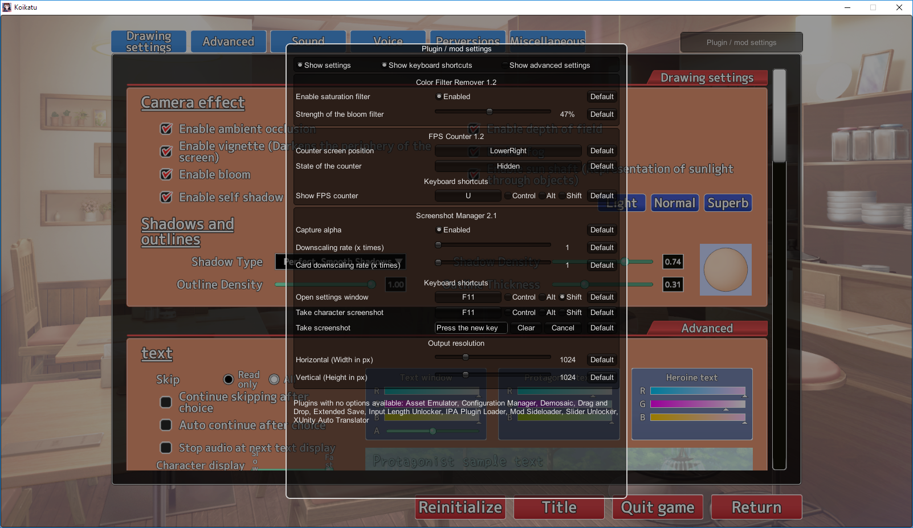

## Plugin / mod configuration manager for BepInEx
An easy way to let user configure how a plugin behaves without the need to make your own GUI. The user can change any of the settings you expose, even keyboard shortcuts. The configuration manager can be accessed from in-game settings screen. To access the manager in studio press F1.

## How to make my mod compatible?
ConfigurationManager will automatically display all of your properties with BepInEx.ConfigWrappers. Properties can be either public or private. They have to be in the main plugin class to be seen.

Additionally, normal public properties will also be displayed, as long as they have both getter and setter.

It's recommended that you put all of your settings into BepInEx.ConfigWrapper, because they will be automatically saved and loaded on game restart.

### Example code
Example code used in the Screenshot Manager (visible in the screenshot below). [View full source](../Screencap/ScreenshotManager.cs).
```c#
// Override display name and set a category
[Category("Output resolution")]
[DisplayName("Horizontal (Width in px)")]
// Specify range of values that can be set to this setting. This will make the setting display as a slider.
[AcceptableValueRange(2, 4096, false)]
// Use a property instead of a field to let ConfigWrapper see your setting.
public ConfigWrapper<int> ResolutionX { get; } = new ConfigWrapper<int>("resX", "plugin GUID", 1024);

[Category("Output resolution")]
[DisplayName("Vertical (Height in px)")]
[AcceptableValueRange(2, 4096, false)]
public ConfigWrapper<int> ResolutionY { get; }

// A keyboard shortcut that can be modified by the user.
// Warning: This class already uses a ConfigWrapper internally, so don't do ConfigWrapper<SavedKeyboardShortcut>!
public SavedKeyboardShortcut CK_Capture { get; }

public ScreenshotManager()
{
    // Initialize the setting in your constructor to avoid having to copy GUID, and to allow dynamic default values.
    // Warning: Initialize all visible settings before Configuration manager window has a chance to show!
    ResolutionY = new ConfigWrapper<int>("resolution-y", this, Screen.height);
    
    CK_Capture = new SavedKeyboardShortcut("Take screenshot", this, new KeyboardShortcut(KeyCode.F9));
}
```



## How to change how my settings are displayed in the configuration manager window?
You can add attributes to your properties to change how the settings are shown. Most of the attributes are from the System.ComponentModel namespace.
```c#
// Name of your setting. If not set, Key from ConfigWrapper is used, or if that's not available the property name is used.
// Settings are sorted alphabetically by this name. You can add ! at the start to move your setting to the top of the list.
[System.ComponentModel.DisplayName]

// Category to show your setting under. Doesn't work for keyboard shortcuts.
// Set to an empty string or null to show without a category.
// If you set a custom Section in ConfigWrapper, it will be used if this attribute is missing.
[System.ComponentModel.Category]

// Configure if the setting is shown to the user or not.
// Can be applied to your entire plugin class to completely hide all settings.
[System.ComponentModel.Browsable]

// Shows a default button next to the field. When clicked, the supplied value is set to the setting.
// Warning: Make sure it's the same type as your setting!
// If you are using a ConfigWrapper, this is not necessary. The default value that you supply to ConfigWrapper is used instead.
[System.ComponentModel.DefaultValue]

// Show this text in a baloon tip under mouse when your setting is hovered.
[System.ComponentModel.Description]
```
### How to make my setting into a slider?
1. You have to reference the ConfigurationManager project or .dll in your plugin. 
2. Add AcceptableValueRangeAttribute to your setting property. Make sure values you enter are the same type as your setting!
```c#
[AcceptableValueRange(2, 4096, false)]
public ConfigWrapper<int> ResolutionX { get; }
```

### How to make my setting into a combo box?
1. You have to reference the ConfigurationManager project or .dll in your plugin. 
2. Add AcceptableValueListAttribute or alternatively use an enum type. Make sure values you enter are the same type as your setting!
```c#
// Values that user can set are specified by an attribute. 1, 5, 10 and 15 will appear in the setting's dropdown.
// All values need to be of the same type as the setting itself (in this case int).
[AcceptableValueListAttribute(new object[] { 1, 5, 10, 15 })]
public ConfigWrapper<int> ResolutionX { get; }

// If you don't know what settings will be available until the game is running, you can specify a method name.
// Every time the setting manager is shown this method will be called to get a list of acceptable values.
[AcceptableValueListAttribute(nameof(CustomValueListGenerator))]
public ConfigWrapper<int> ScreenMode { get; }

// The method used to get acceptable values has to be an instance method, and it has to return object[].
private object[] CustomValueListGenerator()
{
    return new object[] { 6, 9 });
}

// If you use an enum you don't need to specify AcceptableValueListAttribute.
// All enum values are shown automatically. If you want to hide some values, you will have to use the attribute.
public ConfigWrapper<SomeEnumType> TextAlignment { get; }
```
Note: You can add System.ComponentModel.DescriptionAttribute to your enum's items to override their displayed names. For example:
```c#
public enum MyEnum
{
    // Entry1 will be shown in the combo box as Entry1
    Entry1,
    [Description("Entry2 will be shown in the combo box as this string")]
    Entry2
}
```

### How to make a custom editor for my setting?
You can add a [CustomSettingDrawAttribute] to your setting with the name of your custom editor method. The method needs to be an instance method with signature `void Name ()`. It runs in OnGUI in an GUILayout window.
```c#
[CustomSettingDrawAttribute(nameof(CustomDrawer))]
public ConfigWrapper<string> Test { get; }

void CustomDrawer()
{
    // Make sure to use GUILayout.ExpandWidth(true) to use all available space
    GUILayout.Label(Test.Value, GUILayout.ExpandWidth(true));
}
```

### How to allow user to change my keyboard shorcuts / How to easily check for key presses?
1. You have to reference the ConfigurationManager project or .dll in your plugin. 
2. Add property with SavedKeyboardShortcut to your main class.
3. Use this property to check for inputs (recommend using IsDown) inside of your Update method.

The KeyboardShortcut class supports modifier keys - Shift, Control and Alt. They are properly handled, preventing common problems like K+Shift+Control triggering K+Shift when it shouldn't have.

Warning: This class already uses a ConfigWrapper internally, so don't wrap it in a ConfigWrapper! (it won't work)

```c#
public SavedKeyboardShortcut ShowCounter { get; }

public Constructor()
{
    ShowCounter = new SavedKeyboardShortcut("Show FPS counter", this, new KeyboardShortcut(KeyCode.U));
}

private void Update()
{
    if (ShowCounter.IsDown())
    {
        // Handle the key press
    }
}
```
